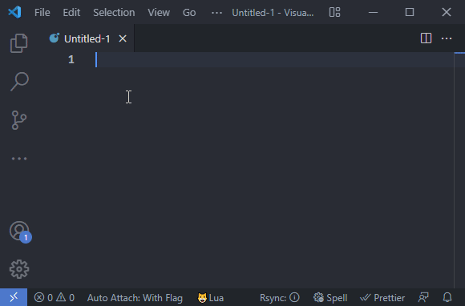
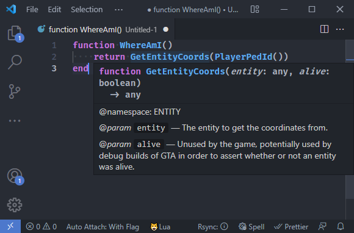

== Generator for EmmyLua Annotations for FiveM ==




=== Build Usage ===
 - npm i -g fivem-emmylua-generator
 - `fivem-emmylua-generator process <source> [dest]`
   - Example:
    - `fivem-emmylua-generator process ../source-fivem/ext/native-decls/ ../library/decls.lua`
    - `fivem-emmylua-generator process ../natives/ dist/natives.lua`
These steps will generate the emmylua definitions for all the fivem natives and cfx functions using the provided markdown files.

For the files included, I used the [natives](https://github.com/citizenfx/natives) repo, and the [fivem source code](https://github.com/citizenfx/fivem) repo as the sources, along with copying the `codegen_types.lua` from the fivem core.


=== How to use with VSCode ===
- `git clone git@github.com:nullvariable/fivem-emmylua-generator.git`
- Install the sumneko.lua VSCode language server: [(https://marketplace.visualstudio.com/items?itemName=sumneko.lua)]
- Add these settings to your vscode settings.json:
```json
    "Lua.workspace.library": [
        "<path to git repo>/dist/"
    ],
    "Lua.completion.autoRequire": false,
    "Lua.runtime.nonstandardSymbol": [
        "`"
    ],
```
- Restart VSCode
- ...
- Profit!

=== How to uninstall ===
- Remove any VSCode settings you may have added
- `npm uninstall -g fivem-emmylua-generator` (optional if you built/rebuilt source files)
- Delete git folder
